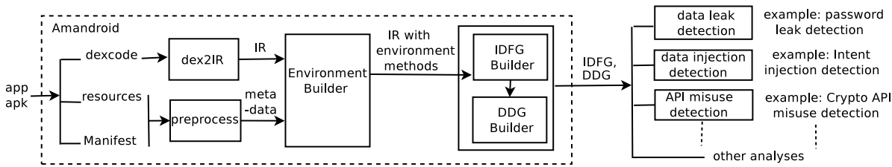

# CCS 2014 Amandroid

## 研究背景

1. **研究问题**：这篇文章提出了一种新的静态分析方法，用于对Android应用程序进行安全审查。具体来说，作者构建了一个名为Amalgam的通用框架，用于在Android应用程序组件之间以流和上下文敏感的方式确定所有对象的信息指向。

2. 研究难点

   ：该问题的研究难点包括：

   - Android是一个基于事件的系统，控制流由应用程序环境中的事件触发，如何捕获所有可能的控制流路径而不引入过多的虚假路径（误报）是一个重大挑战。
   - Android运行时包含大量库代码，完全分析整个库代码可以提高分析精度，但也可能非常昂贵。
   - Android是一个基于组件的系统，广泛使用跨组件通信（ICC），准确捕获所有ICC流是一个主要挑战。

3. 相关工作

   ：该问题的研究相关工作有：

   - FlowDroid：形式化建模了Android应用程序的事件驱动生命周期，但未处理ICC。
   - Epicc：静态分析了ICC，并使用IDE框架解决ICC调用参数，但未将ICC调用源链接到目标，也未进行跨组件边界的数据流分析。
   - CHEX：使用不同的方法对Android环境进行建模，但未处理ICC数据流。

## 研究方法

这篇论文提出了Amalgam框架用于解决Android应用程序的安全审查问题。具体来说，

1. **IR转换**：首先，Amalgam将应用程序的Dalvik字节码转换为适合静态分析的中间表示（IR）。IR转换工具是对原始dexdump工具的修改版本。

2. **环境建模**：Amalgam生成一个环境模型，模拟Android系统与应用程序的交互，以限制分析的范围以提高可扩展性。环境模型包括组件级别模型，捕捉Android系统对应用程序控制和数据的影响。

   

   

3. **跨组件数据流图（IDFG）构建**：Amalgam构建整个应用程序的精确跨组件数据流图（IDFG），包括控制流图和对象创建站点集合。IDFG的构建基于经典的静态分析方法，同时计算流和上下文敏感的对象指向信息。

   

   

4. **数据依赖图（DDG）构建**：在IDFG的基础上，Amalgam构建了数据依赖图（DDG），反映实例和变量定义在程序中的流动。DDG自动捕捉跨组件边界的数据依赖。

5. **安全分析插件**：Amalgam提供了一个抽象层，用于各种类型的安全分析。通过开发插件，可以利用IDFG和DDG来解决特定的安全问题。

## 实验设计

1. **数据集**：实验使用了多个数据集，包括753个流行的Google Play应用程序、100个来自Arbor Networks的潜在恶意应用程序，以及两个基准测试集（由其他研究人员和我们自己手工制作的应用程序）。

2. **性能评估**：实验在一台配备2 x 2.26 GHz Quad-Core Xeon和32GB RAM的机器上进行。Amalgam提供了多种精度级别，实验中设置了上下文长度k=1，表示跟踪最多一个调用上下文。

   

   

3. **安全分析**：实验进行了多种类型的安全分析，包括数据泄漏检测、数据注入检测和API滥用检测。通过定义源和接收器，使用DDG进行标准数据依赖分析。

## 结果与分析

1. **性能与可扩展性**：构建IDFG是Amalgam中最耗时的步骤。对于853个真实世界应用程序，构建IDFG的中位数时间为29秒，最小时间为2秒，最大时间为113分钟29秒。后续分析（如构建DDG和运行专用分析）的运行时间可以忽略不计。
2. **数据泄漏检测**：发现了多个密码泄漏案例，包括明文记录密码、通过HTTP通道发送密码到网络API、以及将密码保存到SharedPreferences。还发现了多个OAuth令牌泄漏案例，包括通过隐式意图发送令牌到恶意应用程序和具有Log读取权限的应用程序窃取令牌。
3. **数据注入检测**：发现了多种意图注入问题，包括攻击者控制TwitterLoginActivity中的“url”字符串和ICC的目标取决于攻击者控制的传入意图。
4. **API滥用检测**：发现了多个应用程序违反不使用ECB模式进行加密的规则，例如使用AES加密用户凭证并将结果存储在SharedPreferences中。

## 总体结论

本文提出了Amalgam，一个通用的静态分析框架，用于Android应用程序的安全分析。Amalgam能够精确跟踪应用程序在多个组件之间的控制和数据流，并以跨组件数据流图和数据依赖图的形式抽象应用程序的行为。实验结果表明，Amalgam具有良好的可扩展性，并且可以有效地应用于解决各种专门的安全问题，性能优于现有的静态分析工具。

# 论文评价

## 优点与创新

1. **全面性**：Amandroid能够计算出应用程序中所有对象及其字段在每个程序点和调用上下文中的指向信息，这对于分析多种安全问题非常有用。
2. **高精度控制流图**：Amandroid能够构建一个高度精确的跨过程控制流图（ICFG），并且该图是流动和上下文敏感的。
3. **ICC支持**：Amandroid将ICC（组件间通信）视为方法调用，并能够在ICFG中包含ICC边。这使得Amandroid能够进行基本的字符串分析以推断ICC调用参数，并根据流动/上下文匹配算法将ICC源链接到目标。
4. **数据依赖图（DDG）**：Amandroid从IDFG构建了应用程序的数据依赖图，这使得分析师可以轻松添加插件来检测特定的安全问题。
5. **可扩展性**：Amandroid的核心框架可以通过添加少量代码（约100行）来扩展到各种专门的安全分析，且额外运行时间可以忽略不计。
6. **实验结果**：Amandroid在处理密码泄露、OAuth令牌泄露、意图注入和加密API误用等安全问题方面表现出色，并且在多个基准测试中优于现有的静态分析工具。

## 不足与反思

1. **异常处理能力有限**：如果应用程序存在安全问题，其中异常处理器的代码起作用，Amandroid可能无法检测到。未来工作将解决这一限制。
2. **反射和并发处理不足**：Amandroid目前不支持反射和并发处理。添加对反射的支持类似于处理ICC，而Amandroid已经具备一些初步的字符串分析能力。
3. **多组件并发处理**：应用程序可能有多个组件，它们可能以某种方式交错运行，可能存在仅在多个组件以特定方式交错运行时才显现的安全问题。在静态分析中一般性地处理并发是一个挑战，未来研究将探讨这一问题。
4. **模型依赖性**：Amandroid的数据和控制流分析依赖于模型的准确性，包括Android环境及其API的模型。由于库的大小，为每个库API开发精确且健全的模型仍然是一个挑战。

# 关键问题及回答

**问题1：Amalgam框架在处理Android应用程序的跨组件通信（ICC）方面有哪些独特的优势？**

Amalgam框架在处理Android应用程序的跨组件通信（ICC）方面具有以下独特优势：

1. **全面的ICC参数推断**：Amalgam不仅推断ICC API调用参数，还使用这些信息来解析ICC调用目标，并将源与可能的目标链接起来。这使得Amalgam能够检测到复杂的ICC数据流问题。
2. **精确的ICC数据流分析**：Amalgam通过其对象敏感的字符串分析和上下文敏感的匹配算法，能够精确地推断ICC调用的参数，并链接ICC调用源到目标。
3. **集成控制流和数据流分析**：Amalgam在构建跨组件数据流图（IDFG）的同时，也计算流和上下文敏感的对象指向信息，确保了分析结果的精确性。
4. **环境模型的组件级别建模**：Amalgam引入了组件级别模型，捕捉Android系统对应用程序控制和数据的影响，从而更有效地分析ICC相关的安全问题。

**问题2：Amalgam框架在数据泄漏检测方面有哪些具体的实现方法和发现？**

Amalgam框架在数据泄漏检测方面采用了以下具体实现方法和发现：

1. **定义敏感数据的源和汇**：通过识别应用程序代码中与敏感数据相关的变量（如用户密码），并将其定义为源。同时，定义可能的数据泄漏汇（如日志记录API、网络请求等）。
2. **使用DDG进行数据依赖分析**：Amalgam构建数据依赖图（DDG），反映实例和变量定义在程序中的流动。通过查询DDG，检查是否存在从源到汇的数据依赖链。
3. **发现多种数据泄漏模式**：实验中发现了一些典型的数据泄漏模式，包括密码明文记录、通过HTTP发送密码、将密码保存到SharedPreferences中等。例如，发现一个应用程序将用户密码明文记录在日志中，或将密码通过HTTP发送到服务器。

**问题3：Amalgam框架在性能评估中表现如何？特别是在构建IDFG的时间方面有哪些具体数据？**

Amalgam框架在性能评估中表现良好，特别是在构建跨组件数据流图（IDFG）的时间方面：

1. **构建IDFG的时间**：实验在一台配备2 x 2.26 GHz Quad-Core Xeon和32GB RAM的机器上进行。Amalgam构建IDFG的中位数时间为29秒，最小时间为2秒，最大时间为113分钟29秒。
2. **分析时间的可忽略性**：一旦IDFG构建完成，后续的分析时间（如构建数据依赖图DDG和运行专门的安全分析插件）可以忽略不计。
3. **可扩展性**：Amalgam在处理大规模应用程序时表现出良好的可扩展性，能够在合理的时间内完成对多个应用程序的安全分析。