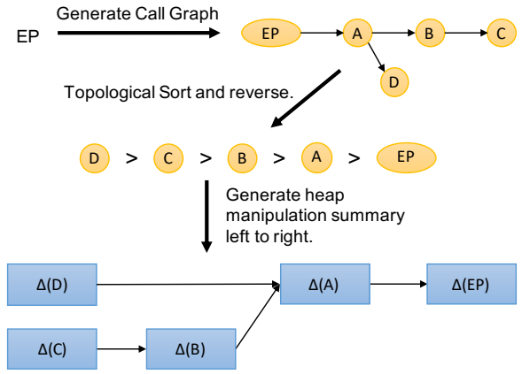

# CCS2018 JN-SAF

## 研究背景

1. **研究问题**：这篇文章要解决的问题是如何在Android应用中精确高效地进行跨语言静态分析，特别是针对包含本地代码的应用进行安全性审查。现有的Android静态分析工具（如Amalgamator、FlowDroid、DroidSafe、Ic-cTA和CHEX）都无法处理本地方法调用和数据流行为。

2. 研究难点

   ：该问题的研究难点包括：

   - 数据流分析在Dalvik字节码和本地二进制之间有完全不同的算法和对象指向信息表示，如何统一表示以整合两种世界的数据流分析结果是一个重大挑战。
   - 实际的数据流分析框架需要在精度和效率之间找到平衡点。精确的数据流分析对Java世界和本地世界都计算密集，且两者可以相互影响数据流事实，导致数据流分析中的多次交织。
   - 需要精确跟踪本地组件、NDK库和JNI数据结构的数据流。

3. 相关工作

   ：该问题的研究相关工作有：

   - 设计或利用静态分析工具来检测Android应用中的安全问题。
   - 现有的Android静态分析框架（如Amalgamator、FlowDroid、DroidSafe、Ic-cTA和CHEX）都无法处理本地方法调用和数据流行为。

## 研究方法

这篇论文提出了JN-SAF（Java-Native Safe Analysis Framework），用于解决Android应用中跨语言静态分析的问题。具体来说，

1. **总结式自底向上数据流分析（SBDA）**：首先，论文采用总结式自底向上的数据流分析方法（SBDA），通过一次遍历每个方法生成统一的堆操作摘要，从而高效地计算流和上下文敏感的跨语言数据流信息。

   

2. **本地方法调用解析**：为了辅助数据流分析引擎找到本地方法被调用的目标，论文提出了一种“本地方法映射”数据结构。该结构通过解析NDK库和JNI函数签名来生成本地方法名及其对应的so文件。

3. **利用现有二进制分析工具**：论文利用Angr进行符号执行，并实现了一个基于注释的数据流分析器（ADA），该分析器能够理解NDK库和JNI函数的语义，并进行精确的跨语言数据流分析。

   

4. **处理本地Activity**：论文提出了一种方法来全面建模本地Activity组件，包括回调函数地址的解析和显式调用回调函数的方法。

   

## 实验设计

论文在基准测试和真实世界应用上对FN-SAF进行了广泛评估。实验设计包括以下几个方面：

1. 数据集：实验使用了三个数据集：
   - NativeFlowBench：由作者创建的22个手工制作的基准应用，测试跨语言数据流分析的各种挑战。
   - AndroZoo：从AndroZoo随机选择的100,000个流行应用。
   - AMD数据集：包含24,553个恶意软件应用的AMD数据集。
2. 实验问题：实验旨在回答以下研究问题：
   - RQ1：真实世界Android应用中本地库的使用统计情况。
   - RQ2：FN-SAF的运行时间如何扩展。
   - RQ3：FN-SAF在基准测试应用上的表现如何。
   - RQ4：FN-SAF是否能够发现关键的安全问题以帮助实际应用审查。
3. **实验环境**：实验在一台配备2.20 GHz、48核Xeon和256 GB RAM的机器上进行。

## 结果与分析

1. **本地库使用统计**：在AndroZoo和AMD数据集中，分别有39.7%和22.0%的应用使用了本地库。大多数本地方法调用涉及数据通信。
2. **运行时间扩展性**：构建SBDA的时间在10,000个随机选择的实际应用组件中平均为42.288秒。构建函数摘要的时间在2,000个随机选择的实际应用本地函数中平均为88.982秒。构建所有579个本地Activity分析的时间平均为570.513秒。
3. **基准测试应用表现**：在NativeFlowBench基准测试中，JN-SAF在所有测试用例中都报告了正确的数据泄漏路径，而其他工具则存在各种错误。
4. **实际应用安全性审查**：在AMD数据集中，JN-SAF能够检测到8个恶意软件家族中的9个包含本地负载的家族，唯一漏检的是Lotoor家族。

## 总体结论

这篇论文提出了JN-SAF，第一个能够在Android应用中进行精确和高效的跨语言数据流分析的静态分析框架。JN-SAF通过总结式自底向上的数据流分析方法，全面建模了JNI函数、NDK库和本地Activity，能够有效地解决实际Android应用中的安全问题。实验结果表明，JN-SAF在基准测试和实际应用中表现出色，能够发现关键的安全问题。

# 论文评价

## 优点与创新

1. **提出了基于摘要的自下而上的数据流分析（SBDA）方法**：该方法能够高效地计算流和上下文敏感的跨语言数据流信息。摘要的性质使得设计统一的堆操作摘要表示成为可能，自下而上的方法确保每个方法只被访问一次，从而提高了效率。
2. **全面建模了Java Native Interface（JNI）和Native Development Kit（NDK）**：现有的二进制分析框架无法处理Android二进制文件，本文提出的框架能够精确跟踪数据流，并建模NDK库和JNI数据结构。
3. **设计了JN-SAF框架**：JN-SAF是第一个能够进行跨语言数据流跟踪的Android静态分析框架。实验结果表明，JN-SAF能够对实际应用程序进行安全审查，并发现有趣的跨语言安全问题。
4. **高效的跨语言数据流分析**：通过SBDA算法，JN-SAF能够在保证精度的同时提高分析效率，减少了上下文切换的频率。
5. **全面的Java和本地代码分析**：JN-SAF利用现有的静态分析工具（如Angr）进行数据流分析，并通过自定义注解和SimProcedure技术实现对NDK库和JNI函数的精确建模。

## 不足与反思

1. **字符串操作的精确解析**：跨语言相关操作（如JNI反射调用构建、动态函数注册和Intent值解析）需要精确解析字符串值。当前实现中，JN-SAF在JavaDroid和NativeDroid中进行常量字符串传播，如果字符串被操纵，将无法构建精确值。未来的研究将致力于改进字符串分析的精确性。
2. **JavaDroid的局限性**：JavaDroid继承自Amalgamator的一些限制，包括不处理Java反射和动态类加载，摘要生成的精度和可靠性依赖于库API模型的忠实度，以及无法处理细粒度的并发执行。
3. **NativeDroid的路径爆炸问题**：NativeDroid基于Angr的符号执行引擎，符号执行技术在大程序中自然会遇到路径和状态爆炸问题。为了缓解这一问题，NativeDroid需要更好地约束可能的执行路径和状态。
4. **反混淆技术的缺乏**：为了规避静态分析的检测，Java和本地代码可以使用字符串加密和动态代码加载等混淆技术。当前JN-SAF没有提供针对这些混淆技术的解决方案，未来可以考虑应用反混淆技术来提高检测能力。

# 关键问题及回答

**问题1：JN-SAF在处理本地方法调用时，如何解析本地方法名及其对应的so文件？**

JN-SAF通过一种名为“本地方法映射”的数据结构来解析本地方法名及其对应的so文件。具体步骤如下：

1. **默认解析**：首先，JN-SAF遵循JNI规范中的命名约定，通过生成相应的本地方法名来解析本地方法调用。例如，`MainActivity.propagateData()`会解析为`Java_test_multiple_1interactions_MainActivity_propagateData`。
2. **动态注册解析**：如果开发者动态注册了本地方法签名，JN-SAF会解析这些注册信息。它通过实现`JNI_OnLoad()`方法并使用Angr进行符号执行来获取这些信息。具体来说，JN-SAF会在`JNI_OnLoad()`方法中构造一个假的`JNIEnv`指针，并通过模拟`GetEnv()`函数初始化该指针。然后，它挂钩`SimProcedure(RegisterNatives)`来获取`gMethods`数组的内存地址，并根据该地址解析每个元素，找到对应的本地函数地址。

**问题2：JN-SAF如何利用Angr进行NDK/JNI感知的跨语言数据流分析？**

1. **自定义注释**：JN-SAF设计了两种自定义注释来辅助NDK/JNI感知的跨语言数据流分析：

- **SummaryAnnotation**：用于捕获Java操作相关的数据。
- **TaintAnnotation**：用于标记敏感数据，如源和汇点API。

1. **SimProcedure**：JN-SAF使用Angr的SimProcedure功能来模拟NDK库和JNI函数的行为。例如，`GetStringUTFChars()`函数会被模拟为一个SimProcedure，它将第一个参数的值传递给返回值。
2. **数据流分析**：在数据流分析过程中，ADA会检查每个方法调用是否是源或汇点API，并相应地添加TaintAnnotation。然后，它会将这些注释与SummaryAnnotation结合，生成方法的摘要。
3. **跨组件分析**：JN-SAF利用Amalgamator的基于组件的分析模型来解决Java和本地组件之间的跨组件通信（ICC）问题。

**问题3：JN-SAF在处理本地Activity时，如何全面建模本地Activity组件？**

1. **回调函数地址解析**：JN-SAF通过符号执行解析本地Activity的回调函数地址。具体来说，它会在`ANativeActivity_onCreate()`方法中构造一个假的`ANativeActivityCallbacks`结构，并通过模拟执行来获取回调函数的地址。
2. **显式调用回调函数**：JN-SAF挂钩每个回调函数到`ANativeActivity_onCreate()`，并从该方法开始进行数据流分析（ADA）。这样，它可以正确地解析和执行回调函数中的代码。
3. **环境模型**：JN-SAF使用Amalgamator的环境模型来生成每个Java组件的环境方法，并将其作为数据流分析的起点。对于本地Activity，它会生成一个环境函数作为起点，并显式调用回调函数。

通过这些方法，JN-SAF能够全面建模本地Activity组件，并准确地进行跨语言数据流分析。