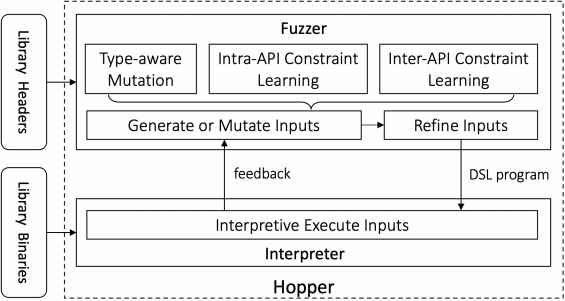

## 研究背景

1. **研究问题**：这篇文章要解决的问题是如何在不依赖领域知识的情况下对库进行模糊测试。现有的模糊驱动程序通常由开发者手动编写，质量依赖于开发者对代码的理解。自动化生成模糊驱动程序的尝试虽然存在，但生成的驱动程序仅限于被学习代码的特定调用序列。
2. **研究难点**：该问题的研究难点包括：如何自动生成能够覆盖库中所有API调用的模糊驱动程序；如何在模糊测试过程中正确学习和应用API的内部和外部约束。
3. **相关工作**：该问题的研究相关工作有：基于学习的模糊驱动程序生成方法（如FuzzGen）和基于模型的模糊驱动程序生成方法（如GraphFuzz）。这些方法在API可用时效果较好，但在API不可用时表现不佳，且依赖于外部输入（如消费者代码或用户提供的规范），这可能导致不准确的约束和不完整的覆盖。

## 研究方法

这篇论文提出了Hopper，用于解决库模糊测试中的挑战。具体来说，

1. **将库模糊测试转化为解释器模糊测试**：Hopper通过将库与轻量级解释器链接，解释器可以解释描述任意API调用的输入。为了生成对解释器语义正确的输入，Hopper学习库中的内部和外部API约束，并以语法感知的方式进行变异。

   

   

2. **引入领域特定语言（DSL）**：Hopper使用DSL来描述任意API调用。DSL程序的每个语句都有一个唯一索引，其后继语句可以引用它。常见的模糊行为被归类为五种语句类型：加载语句、调用语句、更新语句、断言语句和文件语句。

3. **语法感知的输入变异**：Hopper通过解析输入的编码语法并遵循约束来变异输入。例如，Superion使用抽象语法树作为中间表示，并在树上进行三种主要操作：替换节点、拼接树和最小化树。

4. **覆盖引导的模糊测试**：Hopper根据覆盖反馈保持触发新路径的输入，并进一步变异它们以进入更深的分支或发现新的错误。

5. **约束学习**：Hopper通过库的运行时反馈而不是外部来源学习内部和外部API约束。内部API约束包括非空指针、有效文件资源、特定值、有界范围、数组长度和特定类型转换。外部API约束通过静态组装库API并通过覆盖反馈动态验证其有效性来学习。

## 实验设计

1. **数据收集**：实验在11个广泛使用的真实世界库上进行，包括cJSON、c-ares、libpng、lcms、libmagic、libpcap、zlib、re2、sqlite3、libvpx和libaom。所有库均为最新版本，并在测试时使用了多个手动编写的模糊驱动程序（MCF）。
2. **实验设计**：每个实验中，测试模糊器在一个核心上运行24小时。之后，重新编译测试库并启用LLVM的源代码覆盖功能，再次运行模糊器以收集覆盖信息。每个实验重复五次，报告平均结果。对于包含多个MCF的库，分别使用LibFuzzer运行每个驱动程序24小时。
3. **样本选择**：选择了11个库的最新版本进行测试，以确保实验结果的时效性和代表性。
4. **参数配置**：在每次实验中，模糊器配置为在一个核心上运行，运行时间为24小时。使用LLVM的源代码覆盖功能收集覆盖信息。

## 结果与分析

1. **代码覆盖率**：Hopper在所有库中的行和分支覆盖率均优于其他模糊器（除了re2、libvpx和libaom）。例如，在cJSON库中，Hopper的行覆盖率为90.04%，分支覆盖率为84.06%，而MCF的最佳努力仅为42.92%和46.56%。
2. **错误发现**：Hopper发现了25个新的错误，其中17个已得到库开发者的确认。相比之下，MCF、FuzzGen和GraphFuzz在相同时间内未能发现任何有效错误。
3. **约束学习**：Hopper成功学习了973个内部API约束，整体精确度和召回率分别为96.51%和97.61%。这些约束显著提高了模糊效率，减少了无效搜索空间并防止了虚假崩溃。

## 总体结论

这篇论文提出了Hopper，一种无需领域知识的库模糊测试工具。Hopper通过将库与解释器链接，学习库中的内部和外部API约束，并以语法感知的方式进行输入变异。实验结果表明，Hopper在代码覆盖率和错误发现方面均优于现有的手动编写和其他自动生成的模糊驱动程序，显著提高了模糊测试的效率和效果。

# 论文评价

## 优点与创新

1. **无需领域知识**：Hopper能够在不需要任何领域知识的情况下对库进行模糊测试，通过将库模糊测试问题转化为解释器模糊测试问题。
2. **自动生成输入**：Hopper通过学习库中的内部和外部API约束，生成语义正确的输入，从而提高模糊测试的效率。
3. **语法感知变异**：Hopper在变异程序时考虑语法，确保生成的输入是有效的，并排除误报崩溃。
4. **高效的代码覆盖率**：Hopper在11个真实世界的库上显著提高了代码覆盖率，特别是在cJSON库中，行覆盖率和分支覆盖率分别提高了47.12%和37.50%。
5. **发现新漏洞**：Hopper发现了25个之前未知的漏洞，其中17个已经得到库开发者的确认。
6. **约束学习方法**：提出的内部和外部API约束学习方法能够正确学习库所暗示的约束，从而显著提高模糊测试的效率。

## 不足与反思

1. **C++库兼容性**：目前Hopper仅支持使用C风格头文件的库，对于使用模板的C++库，Hopper难以生成调用C++函数及其参数的调用者。未来工作将计划解决C++库的兼容性问题。
2. **误报崩溃**：尽管Hopper能够通过动态反馈学习常见的约束来过滤大多数误报崩溃，但仍然可能存在误报。未来工作将计划为用户提供未学习约束的警告，并提供方便的添加自定义约束的方式。

# 关键问题及回答

**问题1：Hopper如何通过语法感知的输入变异来提高模糊测试的效果？**

Hopper通过解析输入的编码语法并遵循约束来变异输入，从而提高模糊测试的效果。具体来说，Hopper使用语法感知的输入变异技术，生成结构化输入以绕过程序执行初期的语法检查。例如，Superion使用抽象语法树（AST）作为中间表示，并在树上进行三种主要操作：替换节点、拼接树和最小化树。这些操作确保生成的输入在语法上是正确的，并且能够触发程序的新路径，从而发现新的错误。此外，Hopper还结合覆盖引导的模糊测试技术，保持触发新路径的输入，并进一步变异它们以进入更深的分支或发现新的错误。

**问题2：Hopper如何学习库中的内部和外部API约束？**

Hopper通过库的运行时反馈学习内部和外部API约束。内部API约束包括非空指针、有效文件资源、特定值、有界范围、数组长度和特定类型转换。例如，Hopper通过分析库的函数签名和类型定义，推断出API函数的参数类型和返回类型之间的关系，从而生成符合内部API约束的输入。外部API约束则通过静态组装库API并通过覆盖反馈动态验证其有效性来学习。Hopper会静态分析库API的函数签名，推断出可能的API调用关系，然后通过动态执行和覆盖反馈，验证这些关系的有效性。例如，Hopper会生成多个不同的API调用序列，并通过覆盖跟踪确定哪些序列能够有效触发新路径，从而学习到有效的外部API约束。

**问题3：Hopper在实验中如何证明其优于现有的手动编写和其他自动生成的模糊驱动程序？**

Hopper在实验中通过代码覆盖率和错误发现两个指标证明了其优于现有的手动编写和其他自动生成的模糊驱动程序。具体来说，Hopper在所有库中的行和分支覆盖率均优于其他模糊器（除了re2、libvpx和libaom）。例如，在cJSON库中，Hopper的行覆盖率为90.04%，分支覆盖率为84.06%，而MCF的最佳努力仅为42.92%和46.56%。此外，Hopper发现了25个新的错误，其中17个已得到库开发者的确认。相比之下，MCF、FuzzGen和GraphFuzz在相同时间内未能发现任何有效错误。这些结果表明，Hopper不仅提高了代码覆盖率，还显著增加了错误发现的数量，从而证明了其在库模糊测试中的有效性和优越性。