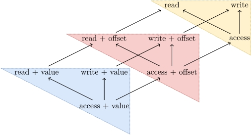
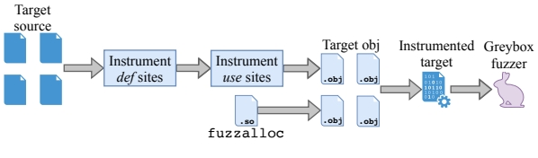
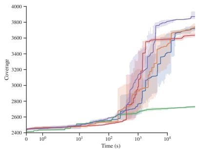

## 研究背景

1. **研究问题**：这篇文章要解决的问题是如何在保持较低开销的情况下，利用数据流分析来指导模糊器（fuzzer）更有效地发现软件中的漏洞。
2. **研究难点**：该问题的研究难点包括：数据流分析的准确性和计算成本高，如何在保证覆盖率的同时降低运行时开销，以及如何在不同目标程序中平衡探索精度和效率。
3. **相关工作**：现有的模糊器主要依赖于控制流覆盖（如基本块覆盖和边缘覆盖），但这些方法在捕捉程序行为方面存在局限性。动态污点分析（DTA）虽然可以提高变异精度，但存在准确性和性能问题。现有的数据流分析技术主要用于编译时的静态分析，尚未在模糊测试中得到充分探索。

## 研究方法

这篇论文提出了DATAFLOW，一种基于轻量级数据流分析的灰盒模糊器。具体来说，

1. **数据流覆盖的定义**：数据流覆盖是指在运行时跟踪变量的定义和使用位置之间的依赖关系（即def/use链）。与传统的基本块和边缘覆盖不同，数据流覆盖能够捕捉到程序运行时的数据流动。

   

   

2. **敏感度分析**：为了平衡效果和性能，定义了数据流覆盖的敏感度。敏感度越高，覆盖指标对程序行为的区分能力越强，但带来的性能开销也越大。通过组合定义点和使用点的敏感度格子，可以在不同粒度上跟踪数据流。

3. **编译时插桩**：使用LLVM的编译时插桩技术，识别并插桩变量的定义点和使用点。插桩后的代码在运行时可以跟踪def/use链。具体插桩方案包括：

- 基于类型的变量分区，限制插桩范围为特定类型的变量。
- 对动态分配的数组变量进行插桩，使用标记版本（如`__tagged_malloc`）来标识定义点。
- 对静态数组变量进行堆化，类似于CCured的方法。

1. **运行时库**：采用低脂肪指针技术，将定义点标签隐式存储在指针中，以便在运行时高效地检索这些标签。具体实现包括：

- 自定义内存分配器fuzzalloc，利用x86_64架构的大虚拟地址空间。
- 通过指针右移操作提取标签信息。

1. 模糊器集成

   ：将数据流覆盖信息用于模糊器的执行。使用哈希函数将定义点和使用点链接成def/use链，并将其作为查找表存储在模糊器的覆盖图中，以指导模糊器发现新的数据流路径。

   

## 实验设计

1. **模糊器选择**：选择了AFL++作为纯控制流驱动的模糊器，Angora作为精确DTA驱动的模糊器，DATAFLOW作为数据流驱动的模糊器。DATAFLOW的配置包括限制插桩范围为数组变量，并使用两种使用点敏感度：简单访问和带偏移的访问。
2. **基准测试选择**：在Magma基准测试的子集和jq JSON处理器上评估模糊器。选择这些基准测试的原因是它们分别代表了控制流与语义解耦和解析器的典型场景。
3. **实验设置**：所有实验在一台配备48核Intel Xeon Platinum 8000 3.6 GHz CPU和192 GiB RAM的Ubuntu 20.04 AWS EC2实例上进行。每个模糊运行持续24小时，重复五次。Magma目标使用提供的种子进行引导，jq使用来自Herrera等人的最小化JSON文件语料库进行引导。

## 结果与分析

1. **bug发现结果**：使用生存分析总结了bug发现结果。DATAFLOW触发了两个之前未被其他模糊器触发的bug（LUA002和LUA003），并发现了XML001，该bug在AFL++和Angora的本次评估中未被触发。

2. 代码覆盖率

   ：通过重放模糊语料库，比较了不同模糊器的代码覆盖率。结果表明，Angora和AFL++（包括CmpLog）覆盖了约3%更多的代码，而DATAFLOW仍然具有竞争力。当考虑访问偏移时，DATAFLOW在def/use覆盖率上比AFL++提高了约5%，比Angora提高了约35%。

   

## 总体结论

这篇论文提出了DATAFLOW，一种基于轻量级数据流分析的灰盒模糊器。初步评估结果表明，数据流驱动的模糊器在大多数目标程序中并未提供显著优势，但在控制流与语义解耦的程序中显示出潜力。未来的研究将进一步评估DATAFLOW在不同目标程序上的表现，并与其他数据流驱动的模糊器进行比较，以更好地理解控制流和数据流覆盖指标的优势和劣势。

# 论文评价

## 优点与创新

1. 提出了一个框架，用于推理和构建基于数据流的覆盖度量指标，适用于灰盒模糊测试。
2. 实现了一个名为DATAFLOW的灰盒模糊器，能够在低开销下探索目标程序的数据流。
3. 对控制流、污点分析和数据流驱动的模糊器进行了初步评估和比较。
4. 通过轻量级数据流跟踪（而非动态污点分析），在不需要高运行时开销的情况下，发现了更多或不同的错误。
5. 提供了一个可调的敏感度范围，允许在探索和精度之间进行平衡。
6. 通过编译时插桩和运行时库的实现，能够在目标程序中有效地跟踪def/use链。
7. 采用了一种低脂肪指针系统，以兼容未插桩/遗留代码并实现廉价的元数据访问。

## 不足与反思

1. 数据流驱动的模糊在大多数目标上并未提供显著优势，未来需要在更广泛的目标上进行更彻底的评估。
2. 需要进一步研究为什么特定目标和错误会从数据流分析中受益。
3. 未来工作将包括在更多目标上测试数据流驱动的模糊的性能，并与更多的数据流驱动模糊器（如SIVO）进行比较。
4. 将开发一种基于静态分析的量化数据流覆盖的方法，以确定给定目标是否适合数据流驱动的模糊。
5. 理解改进DATAFLOW性能是否会改变结果，例如通过支持AFL++的分支服务器和移除堆化操作。

# 关键问题及回答

**问题1：DATAFLOW如何实现轻量级的数据流分析，以减少运行时开销？**

DATAFLOW通过编译时插桩和运行时库的结合来实现轻量级的数据流分析。具体来说，编译时插桩使用LLVM的编译器基础设施来识别和插桩变量的定义点（def sites）和使用点（use sites）。插桩后的目标程序在运行时可以通过自定义的内存分配器fuzzalloc来跟踪数据流。fuzzalloc通过将每个定义点的内存空间映射到独立的mspace，并在mspace的上部16位存储定义点标签，从而实现高效的标签检索。这种方法不仅减少了运行时开销，还保持了较高的覆盖率和准确性。

**问题2：在实验中，DATAFLOW与传统控制流驱动的模糊器（如AFL++）相比表现如何？**

初步评估结果显示，DATAFLOW在大多数目标上并未提供显著优势，但在控制流与语义解耦的程序中显示出潜力。具体来说，DATAFLOW在代码覆盖率上与传统控制流驱动的模糊器（如AFL++和Angora）相当，但在考虑访问偏移时，DATAFLOW在def/use覆盖率上比AFL++提高了约5%，比Angora提高了约35%。此外，DATAFLOW还触发了两个之前未被其他模糊器触发的bug（LUA002和LUA003），并发现了XML001，该bug在AFL++和Angora的本次评估中未被触发。

**问题3：DATAFLOW如何处理C++动态内存分配，以避免std::bad_alloc异常导致的程序崩溃？**

DATAFLOW通过将C++的new调用重写为malloc调用来简化插桩过程。然而，这种方法会导致任何失败的分配都会引起程序崩溃，无论是否有异常处理器。为了处理这种情况，DATAFLOW在实验中通过重放原始二进制文件的输入来过滤掉这些由于内存分配失败导致的程序崩溃。这种方法确保了即使在出现异常的情况下，模糊器也能够继续运行并发现潜在的漏洞。