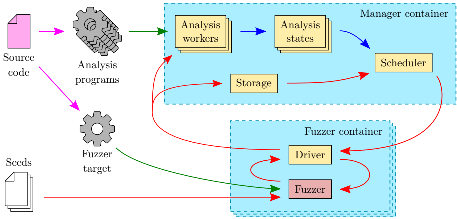

# CollabFuzz EuroSec2021

## 研究背景

1. **研究问题**：这篇文章要解决的问题是如何在多个不同的模糊器之间进行协作，以提高模糊测试的整体效果。具体来说，研究了在模糊器级别上的测试用例调度策略，以优化资源分配和信息交换。
2. **研究难点**：该问题的研究难点包括：不同模糊器有不同的优缺点，如何在协作过程中有效地利用这些优缺点；如何在大规模分布式环境中协调和管理多个模糊器。
3. **相关工作**：该问题的研究相关工作有：ENFUzz展示了通过在不同模糊器之间共享进度，可以显著提高模糊测试的效果；Güler等人提出了自动选择多样化模糊器的组合；其他研究工作还探讨了如何在单个模糊器内优先处理某些测试用例。

## 研究方法

这篇论文提出了CollabFuzz，一个用于协作模糊测试的框架。具体来说，

1. **框架设计**：CollabFuzz允许用户表达不同的测试用例调度策略，如EnFuzz提出的协作方法。该框架控制哪些测试用例分配给哪个模糊器，并允许在网络中协调不同的模糊器。此外，它还允许对生成的测试用例进行集中分析，以便实施基于任意程序（例如数据流）分析结果的调度策略。

   

   

2. **调度策略**：实现了几种相对简单的测试用例调度策略，包括ENFUZZ调度器、广播调度器、收益调度器和成本效益调度器。ENFUZZ调度器每2分钟将所有新测试用例转发给所有参与协作的模糊器。广播调度器消除了同步延迟，立即转发接收到的测试用例。收益调度器引入同步延迟，但每5秒只处理优先级队列中的1%的测试用例，基于未见过的基本块数量和指令数量来计算收益和成本。成本效益调度器结合了收益和成本两个指标，公式如下：

   cost⁡benefit(t)=∑b∈ frontier(t)benefit⁡(t)/cost⁡(b)∣frontier⁡(t)∣costbenefit(*t*)=∣frontier(*t*)∣∑*b*∈ frontier(*t*)benefit(*t*)/cost(*b*)

   其中，收益衡量从测试用例前沿可达的基本块数量，成本衡量计算单个值所需的指令数量。

## 实验设计

实验在一台32核/64线程的AMD ThreadRipper 2990WX处理器上进行，配备128GB内存。每个实验分配4个硬件线程（运行4个模糊器+框架/驱动程序）。模糊器在Docker容器中运行，并启用AFL的核心固定。每个实验运行10小时，重复10次。实验结果显示了分支覆盖度的中位数和在活动结束时分支覆盖度的曲线下面积（AUC）。

## 结果与分析

1. **覆盖度结果**：实验结果表明，不同调度策略在达到饱和覆盖度时的覆盖度通常相似，没有显著差异。
2. **AUC结果**：AUC指标显示覆盖度随时间的演变。不同的调度策略在达到相同结束覆盖度时的时间差异显著，但经过进一步分析，发现这些差异主要是由于随机性引起的，不同调度策略之间的AUC没有显著差异。
3. **速度提升**：尽管覆盖度结果相似，但不同调度策略在达到部分覆盖度时的速度有所不同。ENFUZZ调度器在某些情况下比成本效益调度器快13%。

## 总体结论

本文提出了CollabFuzz，一个允许多个模糊器共享进度的协作模糊测试框架。通过在大规模集群上运行模糊测试活动，证明了模糊器级别的粗粒度测试用例调度对模糊测试活动的结果影响不大。然而，CollabFuzz使开发人员能够通过调度策略轻松表达不同的模糊技术，并收集模糊器统计数据以供进一步分析。

# 论文评价

## 优点与创新

1. **提出了CollabFuzz框架**：CollabFuzz是一个分布式协作模糊测试框架，能够协调多个不同的模糊器，并允许它们基于中心分析进行有信息的调度。
2. **多种测试用例调度策略**：在CollabFuzz上实现并评估了多种测试用例调度策略，展示了该框架在推理调度和资源分配策略方面的潜力。
3. **开源软件**：CollabFuzz作为开源软件发布，提供了灵活的扩展性和可重复性，方便未来的研究和改进。
4. **灵活性**：框架设计灵活，易于扩展，支持多种不同的模糊器，并且可以在大规模分布式环境中运行。
5. **可重复性**：使用Docker实现了所有模糊测试目标的可重复环境。
6. **性能分析**：通过AUC指标评估了不同调度策略的性能，提供了对实际运行速度的深入理解。

## 不足与反思

1. **粗粒度调度的影响有限**：研究表明，模糊器级别的粗粒度调度对模糊测试活动的整体结果影响不大。
2. **静态模糊器集**：当前实现中选择的模糊器集在整个运行过程中是静态的，动态分配模糊器资源可能会产生更好的结果。
3. **细粒度控制机制**：尽管当前的调度策略没有显著改善结果，但引入更细粒度的控制机制（如目标分支的选择）有很大的改进空间。

# 关键问题及回答

**问题1：CollabFuzz框架的设计目标是什么？**

1. **灵活性**：框架设计为易于扩展，组件可重用于其他用途。
2. **可重复性**：使用Docker实现可重复的实验环境。
3. **可扩展性**：支持大规模分布式设置，便于扩展到大型集群。

这些设计目标使得CollabFuzz能够在大规模分布式环境中协调和管理多个模糊器，并通过灵活的调度策略优化资源分配和信息交换。

**问题2：CollabFuzz实现了哪些测试用例调度策略？这些策略的优缺点是什么？**

1. **ENFUZZ调度器**：每2分钟将所有新测试用例转发给所有参与协作的模糊器。优点是简单易实现，缺点是存在2分钟的同步延迟。
2. **广播调度器**：消除同步延迟，立即转发接收到的测试用例。优点是减少了等待时间，缺点是可能会在早期阶段过度处理低质量的测试用例。
3. **收益调度器**：引入同步延迟，但每5秒只处理优先级队列中的1%的测试用例，基于未见过的基本块数量和指令数量来计算收益和成本。优点是专注于高质量的测试用例，缺点是引入了额外的同步延迟。
4. **成本效益调度器**：结合了收益和成本两个指标，公式如下：

cost⁡benefit(t)=∑b∈ frontier(t)benefit⁡(t)/cost⁡(b)∣frontier⁡(t)∣costbenefit(*t*)=∣frontier(*t*)∣∑*b*∈ frontier(*t*)benefit(*t*)/cost(*b*)

优点是综合考虑了测试用例的质量和难度，缺点是计算复杂度较高。

**问题3：实验结果表明不同调度策略在覆盖度和AUC方面的表现如何？**

1. **覆盖度结果**：不同调度策略在达到饱和覆盖度时的覆盖度通常相似，没有显著差异。
2. **AUC结果**：AUC指标显示覆盖度随时间的演变。不同的调度策略在达到相同结束覆盖度时的时间差异不显著。ENFUZZ调度器在某些情况下比成本效益调度器快13%，但没有统计显著差异。

总体而言，尽管不同调度策略在覆盖度和AUC方面没有显著差异，但在达到特定覆盖率时的延迟存在显著差异。ENFUZZ调度器在某些情况下表现更好，但主要是由于随机性的影响。